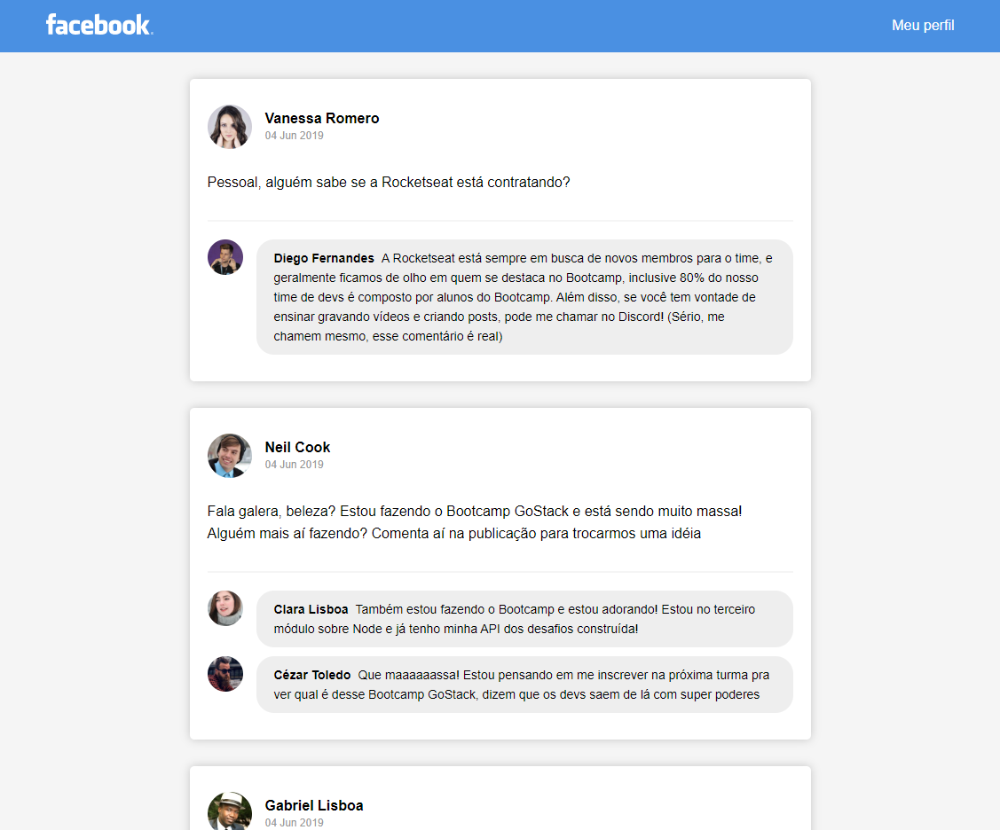

<h1 align="center">Desafio 04 - GoStack - Introdução ao React</h1>

Criação de interface semelhante a do Facebook utilizando ReactJS.

<h3>Tecnologias Utilizadas:</h3>
Webpack, Babel, Webpack Dev Server e ReactJS.
<h3>Resultado Obtido:</h3>
